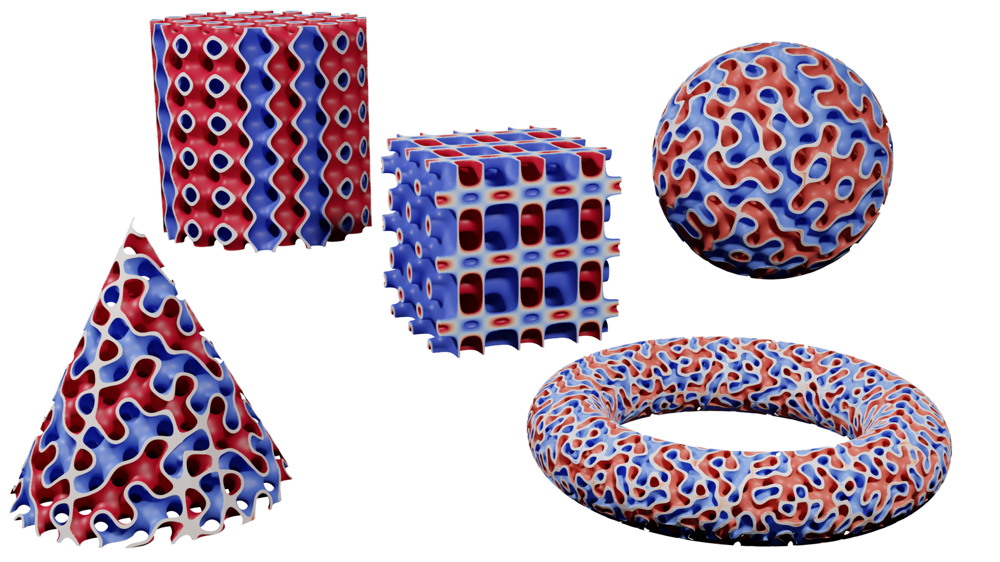
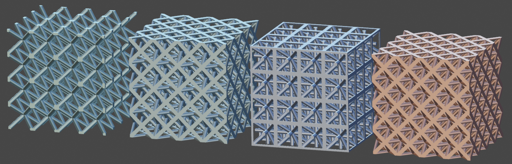

# TPMS generator

  
  

  
  

  
  

  
  

## Triply Periodic Minimal Surface

How to create a TPMS mesh in Blender:

https://github.com/kmarchais/blender-tpms/assets/22714778/80af0ecc-1544-418c-bea5-072051c4b2e1

## Installation

- Download the ZIP file from this repository
- In Blender, `Edit > Preferences > Add-ons > Install...` find the zip file that you just downloaded and click `Install Add-on`
- Enable the add-on by clicking the checkbox (this will install the required python dependencies)
- You are ready to create TPMS meshes in `Add > Mesh > TPMS`

## Coming Soon
- Lattice structures 
- Graded TPMS (density, size, type)
- Ability to modify the TPMS properties even when the operator is not active anymore

If you have a specific feature in mind that you would like to have, or if you're particularly interested in one of the features listed above, please let me know.

## Useful repository
- To create TPMS geometries and meshes (including periodical meshes) for simulation with Python, consider using [Microgen](https://github.com/3MAH/microgen)
